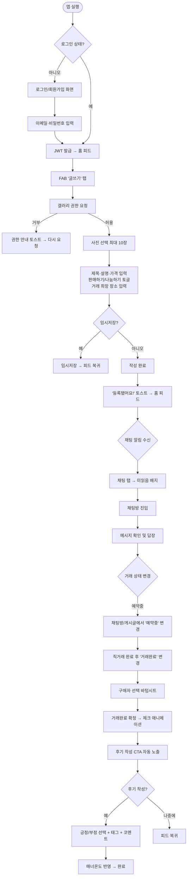
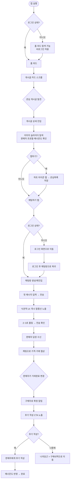
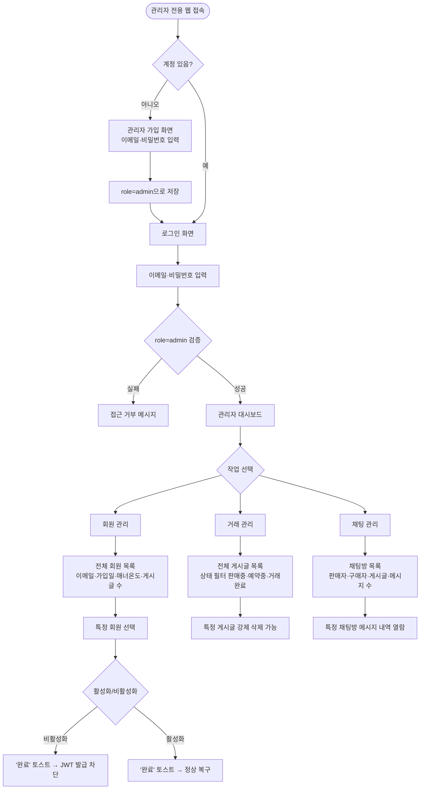

# UX 설계 명세서 — carrot

**작성자:** HEMICOLON
**날짜:** 2026-05-29

---

<!-- UX 설계 내용은 협업 워크플로우 단계에 따라 순차적으로 추가됩니다 -->

## Executive Summary

### Project Vision

carrot은 당근마켓의 핵심 거래 흐름(게시→채팅→거래완료→후기)을 재현한 포트폴리오용 크로스플랫폼 중고거래 서비스다. 하나의 FastAPI 백엔드로 Next.js(사용자 웹), Next.js(관리자 웹), Flutter(모바일 앱) 3개 클라이언트를 통합 제공한다. 위치 기반 기능은 제외하고 전국 단위 게시글 목록을 제공한다.

### Target Users

**일반 회원 (판매자 겸 구매자)**
중고 물품 거래를 원하는 개인. 같은 계정으로 판매자와 구매자 역할을 동시에 수행하며, 모바일 앱과 웹을 모두 사용한다. 핵심 목표: 빠른 게시글 등록, 채팅을 통한 가격 협상, 거래 완료 후 신뢰 확인.

**관리자**
서비스 운영자. 전용 웹 대시보드에서 회원 계정·게시글·채팅을 모니터링하고 필요 시 관리 조치를 취한다. 당근마켓 레퍼런스가 없는 커스텀 UI 설계 필요.

### Key Design Challenges

1. **채팅 딜레이 UX 처리** — DB 폴링(2~3초) 동안 앱이 멈췄다고 인식하지 않도록 낙관적 UI(optimistic update)와 "확인 중" 미세 애니메이션 필요. 메시지 중복 전송 방지 로직 포함.

2. **판매자/구매자 역할 맥락 전환** — 게시글 상세에서 로그인 사용자가 판매자인지 구매자인지를 명확히 표시("내 게시글" 배지). 버튼 분기(수정/삭제 vs 채팅하기)를 역할 맥락에 따라 명확히 구분.

3. **거래완료 플로우 연속성** — 거래완료 버튼 → 구매자 지정 → 후기 작성 유도를 단일 바텀시트/다이얼로그 플로우로 연결. 각 단계 단절 없이 자연스럽게 이어지도록 설계.

4. **3개 플랫폼 브랜드 일관성** — 관리자 웹에도 carrot 로고와 오렌지 색상 계열을 공유. 사용자 웹·앱·관리자 웹이 "같은 서비스"임을 인지시킴.

5. **매너온도 시각화 및 발견성** — 숫자 텍스트 단독 표시 대신 온도계/불꽃 아이콘 + 색상 그라데이션으로 강조. 거래완료 후 후기 작성 CTA 자동 노출.

6. **사진 업로드 UX 투명성** — Flutter 앱 갤러리 권한 요청 타이밍 명확화, 업로드 진행률 표시. 10장 초과 시 자동 컷 + 토스트 메시지.

7. **관리자 UI 제로 베이스 설계** — 당근마켓 레퍼런스 없는 커스텀 UI이나, 사용자 웹과 브랜드 요소(색상·로고) 공유로 일관성 확보.

### Design Opportunities

1. **당근마켓 친숙함 활용** — 한국 사용자에게 익숙한 오렌지 색상·카드형 게시글·하단 3탭 구조를 레퍼런스 삼아 시연 완성도를 빠르게 높일 수 있음.

2. **매너온도 시각적 임팩트** — 온도계/불꽃 아이콘 + 색상 그라데이션으로 포트폴리오에서 인상적인 디테일 연출 가능.

3. **게시글 상태 배지 시스템** — 판매중/예약중/거래완료 배지를 일관된 색상 체계로 디자인하면 목록·상세·관리자 화면에서 모두 재사용 가능.

## Core User Experience

### Defining Experience

carrot의 핵심 경험은 "피드 탐색에서 채팅 시작까지의 마찰 제로"다.

사용자가 홈 피드를 스크롤하다 원하는 물건을 발견하고, 탭 한 번으로 채팅방에 진입하는 이 흐름이 가장 빈번하고 가장 중요한 루프다. 게시글 등록(판매자 액션)은 이 루프에 콘텐츠를 공급하는 역할을 한다.

우선순위:
1. 홈 피드 탐색 — 빠른 스크롤, 카드 정보 밀도 최적화
2. 채팅하기 — 버튼 탭에서 첫 메시지 입력까지 단계 최소화

### Platform Strategy

| 플랫폼 | 입력 방식 | 우선 고려 사항 |
|--------|----------|--------------|
| Flutter 모바일 앱 | 터치 중심 | 하단 탭 네비게이션, 네이티브 제스처, 갤러리 권한 |
| Next.js 사용자 웹 | 마우스+키보드, 터치(반응형) | 반응형 레이아웃, 동일 기능 완전 지원 |
| Next.js 관리자 웹 | 마우스+키보드 | 데이터 테이블 중심, 모바일 최적화 불필요 |

오프라인 기능 불필요. 채팅 폴링은 온라인 연결 전제. 플랫폼별 네이티브 패턴을 존중하되 브랜드 일관성(색상·타이포·배지) 공유.

### Effortless Interactions

다음 액션은 사용자가 생각 없이 수행할 수 있어야 한다:

- **피드 스크롤** — 무한 스크롤, 카드당 대표 사진·제목·가격·상태 배지를 한눈에 파악. 스크롤 속도를 해치는 이미지 로딩 지연 없음(lazy load).
- **채팅하기 진입** — 게시글 상세 하단 고정 버튼. 탭 → 채팅방 즉시 진입(기존 방 있으면 재진입). 신규 방 생성 로딩 피드백 포함.
- **게시글 작성 진입** — 모바일 FAB(우하단 고정), 웹 상단 버튼. 갤러리 권한 요청은 사진 첨부 탭 시점에 한 번만.
- **메시지 전송** — 입력 후 전송 버튼 탭 즉시 낙관적 UI로 말풍선 노출. 폴링으로 확인 전까지 "전송 중" 상태 표시.

### Critical Success Moments

| 순간 | 성공 기준 | 실패 시 영향 |
|------|----------|------------|
| 피드에서 원하는 물건 발견 | 카드 정보(사진·가격·상태)만으로 클릭 결정 | 이탈, 탐색 포기 |
| "채팅하기" 탭 후 첫 메시지 전송 | 3초 이내 채팅방 진입 + 메시지 노출 | 거래 포기 |
| 거래완료 후 매너온도 변화 확인 | 후기 작성 → 온도 반영을 시각으로 즉시 확인 | 기능 인지 실패 |
| 관리자가 회원 비활성화 후 로그인 차단 확인 | 상태 변경 즉시 반영, 시연 흐름 유지 | 관리자 시나리오 시연 실패 |

### Experience Principles

1. **피드 우선** — 모든 진입 화면은 홈 피드로 귀결된다. 로그인 후, 게시글 등록 후, 거래완료 후 모두 피드로 복귀 가능.
2. **채팅은 한 탭** — 게시글 상세에서 채팅방까지 탭 1회. 중간 확인 화면 없음.
3. **상태는 항상 보인다** — 게시글 상태(판매중·예약중·거래완료), 미읽음 배지, 매너온도는 항상 가시적 위치에 노출.
4. **플로우는 끊기지 않는다** — 거래완료→구매자 지정→후기 작성, 사진 업로드→게시글 완성 등 다단계 액션은 단일 시트/화면 내에서 완결.
5. **브랜드는 하나** — 사용자 웹·앱·관리자 웹이 같은 색상·로고를 공유. 사용자는 플랫폼을 바꿔도 "carrot"을 인식한다.

## Desired Emotional Response

### Primary Emotional Goals

**일반 회원 (판매자·구매자):**
- **친숙함(Familiarity)** — 처음 쓰는데도 당근마켓처럼 익숙한 느낌. "어, 이거 써본 것 같은데?" 라는 즉각적 적응감.
- **성취감(Accomplishment)** — 게시글 등록 완료, 거래완료, 후기 작성 후 "내가 해냈다"는 명확한 완결감.
- **신뢰(Trust)** — 매너온도와 후기 시스템이 상대방을 믿어도 된다는 심리적 안전감 제공.

**관리자:**
- **통제감(Control)** — 전체 회원·거래·채팅을 한눈에 파악하고 즉시 조치할 수 있다는 확신.

### Emotional Journey Mapping

| 단계 | 사용자 액션 | 목표 감정 | 회피할 감정 |
|------|-----------|----------|-----------|
| 첫 진입 | 앱/웹 로딩, 홈 피드 확인 | 친숙함, 호기심 | 낯섦, 혼란 |
| 피드 탐색 | 게시글 스크롤 | 기대감, 몰입 | 지루함, 과부하 |
| 게시글 상세 | 사진·가격·판매자 확인 | 신뢰, 관심 | 의심, 불안 |
| 채팅하기 | 첫 메시지 전송 | 설렘, 자신감 | 망설임, 불안 |
| 거래 협상 | 채팅 주고받기 | 연결감, 집중 | 답답함(딜레이) |
| 거래완료 | 상태 변경 + 후기 작성 | 성취감, 만족 | 허탈함, 미완결감 |
| 재방문 | 다시 피드 열기 | 습관적 편안함 | 귀찮음 |

### Micro-Emotions

| 우선 확보 | 회피 대상 |
|----------|---------|
| 자신감(Confidence) — 버튼이 어디 있는지 바로 안다 | 혼란(Confusion) — "이게 뭐지?" |
| 신뢰(Trust) — 매너온도, 후기, 상태 배지 | 불안(Anxiety) — "메시지 전송됐나?" |
| 성취감(Accomplishment) — 거래완료 시 명확한 마무리 | 좌절(Frustration) — 끊기는 플로우 |
| 기쁨(Delight) — 매너온도 시각화, 상태 배지 컬러 | 지루함(Boredom) — 단조로운 피드 |

### Design Implications

- **친숙함 → 오렌지 계열 색상 + 카드형 레이아웃** — 당근마켓 시각 언어 차용. 첫 화면에서 "알고 있는 패턴"을 만나게 함.
- **신뢰 → 매너온도 온도계 시각화 + 상태 배지 일관성** — 텍스트보다 색상·아이콘으로 신뢰 신호를 즉각 전달.
- **성취감 → 거래완료 완결 플로우** — 거래완료 시 축하 마이크로 애니메이션(confetti 또는 체크 애니메이션) 1초 노출. 후기 CTA 자동 연결.
- **불안 제거 → 낙관적 UI + 폴링 상태 표시** — 메시지 전송 즉시 말풍선 노출, "전송 중" 상태 아이콘으로 폴링 딜레이 불안 최소화.
- **통제감(관리자) → 클린 데이터 테이블 + 즉각 피드백** — 회원 비활성화 후 "완료" 토스트 메시지로 조치 결과 즉시 확인.

### Emotional Design Principles

1. **친숙하게 시작, 디테일로 감동** — 레이아웃은 익숙하게, 매너온도·배지 애니메이션 등 디테일에서 "이 앱 잘 만들었다"는 인상 형성.
2. **불안의 원천을 미리 차단** — 폴링 딜레이, 업로드 진행, 역할 혼동 등 모든 불안 요소에 즉각적 시각 피드백 제공.
3. **완결감은 설계한다** — 거래완료·게시글 등록·후기 작성 후 명확한 "끝났다"는 신호(애니메이션·메시지)로 성취감 강화.

## UX Pattern Analysis & Inspiration

### Inspiring Products Analysis

**당근마켓 (Primary Reference)**

carrot의 직접적 레퍼런스. 한국 중고거래 시장 1위 앱으로, carrot이 재현하려는 핵심 거래 흐름의 원본이다.

| UX 영역 | 당근마켓의 접근 | 효과 |
|---------|--------------|------|
| 피드 카드 | 대표 사진 + 제목 + 가격 + 경과 시간 + 채팅수 + 관심수 한 카드에 압축 | 스크롤 중 클릭 결정에 필요한 모든 정보 제공 |
| 하단 탭 | 홈/채팅/나의당근 3개 핵심 탭 | 주요 플로우가 탭 3개로 완결 |
| 채팅 목록 | 게시글 썸네일 + 상대방 이름 + 마지막 메시지 + 시간 + 미읽음 배지 | 어떤 거래인지 사진으로 즉시 맥락 파악 |
| 게시글 상세 | 이미지 슬라이더 상단, 하단 고정 "채팅하기" 버튼 | 사진 탐색 후 즉시 거래 시작 |
| 매너온도 | 🥕 당근 아이콘 + 숫자 + 색상 (낮으면 파랑, 높으면 오렌지) | 숫자 없이 색상만 봐도 신뢰도 파악 |
| 상태 배지 | "예약중"(회색), "거래완료"(진한 회색) 오버레이 | 게시글 목록에서 거래 가능 여부 즉시 확인 |
| 글쓰기 FAB | 우하단 오렌지 원형 FAB, 탭하면 사진 선택 먼저 | 게시글 작성 진입 마찰 최소화 |
| 판매하기/나눔 토글 | 가격 입력란 위에 토글 스위치 | 나눔 시 가격 입력 불필요 명확화 |
| 메인 컬러 | #FF7E36 오렌지 계열 | 따뜻함·친근함·에너지 연상, 브랜드 즉시 인식 |

### Transferable UX Patterns

**네비게이션 패턴**
- **하단 3탭 구조** (홈/채팅/나의당근) — carrot에 그대로 채택. 커뮤니티·지도 탭은 MVP Non-Goal이므로 제외.
- **미읽음 배지(+N)** 채팅 탭 — 숫자 배지 위치·형태 동일하게 채택.

**인터랙션 패턴**
- **하단 고정 CTA** — 게시글 상세 하단에 "채팅하기" 버튼 고정. 스크롤과 무관하게 항상 접근 가능.
- **이미지 슬라이더** — 게시글 상세 상단 전체 너비 슬라이더. 인디케이터 점 표시.
- **낙관적 UI 말풍선** — 메시지 전송 즉시 오른쪽 말풍선 노출, 전송 확인은 폴링 후.
- **무한 스크롤** — 홈 피드 20개씩 추가 로딩. 로딩 스피너 하단 표시.

**시각 패턴**
- **오렌지 메인 컬러** (#FF7E36 또는 유사 계열) — 버튼·FAB·탭 활성 상태·배지.
- **매너온도 색상 그라데이션** — 36.5℃ 기준 이하 파랑, 이상 오렌지/빨강. 텍스트 없이 색상만으로 신뢰도 전달.
- **상태 배지 오버레이** — 게시글 대표 사진 좌상단에 반투명 배지. 판매중(없음)/예약중(회색)/거래완료(진한 회색).

### Anti-Patterns to Avoid

| 안티패턴 | 이유 |
|---------|------|
| 위치 기반 UI 요소 (동네 설정, 반경 필터) | carrot MVP Non-Goal. 추가 시 혼란만 가중 |
| 복잡한 카테고리 트리 필터 | MVP에서 전국 단일 피드. 카테고리 없음 |
| 커뮤니티/동네생활 탭 혼용 | 거래 전용 서비스. 피드와 커뮤니티 혼합 금지 |
| 채팅 목록에 썸네일 없음 | 어떤 거래인지 맥락 손실. PRD FR-14에서 썸네일 필수 명시 |
| 거래완료 후 아무 피드백 없음 | 성취감·완결감 설계 원칙 위반. 반드시 완료 신호 제공 |
| 관리자 웹에 소비자용 오렌지 테마 그대로 적용 | 관리자임을 인지 못함. 같은 브랜드 색상이되 "관리자 전용" 레이블 필요 |

### Design Inspiration Strategy

**채택 (Adopt) — 그대로 가져옴:**
- 하단 3탭 구조 (홈/채팅/나의당근)
- 오렌지 메인 컬러 계열
- 게시글 카드 정보 밀도 (사진+제목+가격+시간+채팅수+관심수)
- 하단 고정 "채팅하기" CTA
- 채팅 목록 썸네일 + 미읽음 배지
- 이미지 슬라이더 (상세 페이지 상단)

**적용 (Adapt) — carrot에 맞게 변형:**
- 매너온도 표시 — 🥕 아이콘 유지 또는 carrot 자체 아이콘으로 변형
- 탭 구조 — 3탭으로 단순화, 추후 확장 고려해 탭 공간 예약
- 관리자 UI — 오렌지 브랜드 컬러 공유하되 대시보드형 레이아웃 독자 설계

**회피 (Avoid):**
- 위치 기반 UI 일체
- 커뮤니티 피드와 거래 피드 혼합
- 복잡한 카테고리/필터 시스템

## Design System Foundation

### Design System Choice

| 플랫폼 | 선택 | 버전 |
|--------|------|------|
| Next.js (사용자 웹, 관리자 웹) | Tailwind CSS + shadcn/ui | Tailwind v3/v4, shadcn/ui latest |
| Flutter (모바일 앱) | Material Design 3 + 커스텀 ThemeData | Flutter 3.x |

### Rationale for Selection

**Next.js — Tailwind CSS + shadcn/ui**
- 현재 Next.js 생태계 사실상 표준. 커뮤니티·예제 풍부.
- 컴포넌트를 프로젝트에 직접 복사-붙여넣기 방식 → 완전한 소유권, 의존성 최소화.
- 오렌지 계열 커스텀 색상 토큰 설정이 `tailwind.config`에서 수 분 내 완료.
- 사용자 웹·관리자 웹이 동일 디자인 시스템 공유 → 브랜드 일관성 자동 확보.

**Flutter — Material Design 3 + ThemeData**
- Flutter 내장 시스템. 별도 패키지 설치 불필요.
- `ColorScheme.fromSeed(seedColor: Color(0xFFFF7E36))`으로 오렌지 계열 전체 팔레트 자동 생성.
- Material 3의 `NavigationBar`(하단 탭), `Card`, `FilledButton` 등이 carrot UI 패턴과 자연스럽게 맞음.
- iOS·Android 모두 동일한 Material 렌더링 → 크로스플랫폼 일관성.

### Implementation Approach

**공통 색상 토큰**

| 토큰 | 값 | 용도 |
|------|-----|------|
| Primary | #FF7E36 | 버튼, FAB, 탭 활성, 배지 |
| On-Primary | #FFFFFF | 버튼 텍스트 |
| Secondary | #6B7280 | 예약중 배지, 보조 텍스트 |
| Surface | #FFFFFF | 카드 배경 |
| Background | #F9FAFB | 페이지 배경 |
| Error | #EF4444 | 에러 상태 |

타이포: 시스템 기본 폰트 (iOS: SF Pro, Android: Roboto, Web: -apple-system)
카드 반경: 12px / 간격 기준: 4px 그리드

**Next.js 구현 순서**
1. `tailwind.config`에 carrot 색상 토큰 등록
2. shadcn/ui init 후 Button, Card, Badge, Input, Dialog, Sheet 컴포넌트 추가
3. `globals.css`에 CSS 변수로 색상 매핑
4. 사용자 웹·관리자 웹 공통 `ui/` 컴포넌트 폴더 공유

**Flutter 구현 순서**
1. `main.dart`에 `ThemeData` 커스텀 (`ColorScheme.fromSeed` 오렌지)
2. `NavigationBar` 하단 3탭 (홈/채팅/나의당근)
3. 공통 위젯: `PostCard`, `StatusBadge`, `MannerTempWidget`, `ChatListTile`

### Customization Strategy

| 컴포넌트 | 커스텀 수준 | 비고 |
|---------|-----------|------|
| 버튼 (Primary) | 오렌지 배경, 흰 텍스트 | shadcn Button variant 오버라이드 |
| 상태 배지 | 판매중(없음)/예약중(회색)/거래완료(진한 회색) | 공통 StatusBadge 컴포넌트 |
| 매너온도 위젯 | 🥕 아이콘 + 숫자 + 색상 그라데이션 | 별도 커스텀 컴포넌트 |
| 채팅 말풍선 | 내 메시지(오렌지 우측), 상대(회색 좌측) | Flutter + Web 동일 패턴 |
| FAB (글쓰기) | 오렌지 원형, 우하단 고정 | Flutter FloatingActionButton |
| 관리자 데이터 테이블 | shadcn DataTable, 오렌지 액센트 유지 | 관리자 전용 레이아웃 |

## 2. Core User Experience

### 2.1 Defining Experience

> **"피드를 스크롤하다 마음에 드는 물건을 발견하고, 탭 한 번으로 판매자와 채팅을 시작한다."**

유명 앱과 비교:
- Tinder: "Swipe to match" → carrot: "Scroll to find, tap to chat"
- 당근마켓: 동일 패턴의 원본

carrot에서 사용자가 친구에게 설명하는 핵심 경험은 이것이다. 게시글 등록·거래완료·후기는 이 루프를 지원하는 기능이다.

### 2.2 User Mental Model

**사용자가 가져오는 기존 멘탈 모델:**
- 당근마켓·번개장터 사용 경험 → "사진 카드 목록 → 상세 → 채팅" 흐름을 이미 알고 있음
- 쇼핑몰 앱 경험 → 카드 탭하면 상세로 이동하는 패턴 친숙
- 카카오톡 경험 → 채팅 목록, 말풍선 UI 친숙

**혼란 유발 가능 지점:**
- "내가 판매자인 게시글에선 채팅하기 버튼이 없다" — 처음엔 의아할 수 있음
- "거래완료 후 후기 작성 화면이 자동으로 뜬다" — 기대하지 않은 흐름
- "채팅 메시지가 2~3초 후 보인다" — 실시간이 아님을 인지 못하면 불안

**기존 솔루션(당근마켓) 대비 단순화 포인트:**
- 위치 기반 동네 설정 없음 → 진입 장벽 없이 바로 피드
- 커뮤니티·지도 탭 없음 → 거래에만 집중
- 카테고리 필터 없음 → 목록 탐색 단순

### 2.3 Success Criteria

| 기준 | 측정 방법 |
|------|---------|
| 피드 진입 후 3초 내 첫 게시글 카드 렌더링 | 로딩 시간 |
| 게시글 상세에서 "채팅하기" 탭 → 채팅방 진입까지 1회 탭 | UX 흐름 단계 수 |
| 첫 메시지 전송 후 말풍선 즉시 노출 (낙관적 UI) | 시각적 피드백 지연 0초 |
| 상대방 메시지 수신까지 최대 3초 | 폴링 주기 |
| 거래완료 플로우 단일 화면 내 완결 | 화면 전환 수 ≤ 1 |

### 2.4 Novel vs. Established Patterns

**기존 패턴 채택 (Established):**
carrot의 핵심 경험은 당근마켓이 이미 검증한 패턴을 재현한다. 사용자 교육이 불필요하다. 익숙한 패턴으로 빠른 적응이 목표.

**carrot만의 단순화 (Innovation within Established):**
- 위치 설정 없는 즉시 피드 진입 → 온보딩 마찰 제거
- 3탭 최소 네비게이션 → 당근마켓 5탭 대비 단순

**폴링 딜레이 처리 (Novel Challenge):**
당근마켓은 Realtime이지만 carrot은 폴링. 사용자가 "실시간처럼 느끼도록" 낙관적 UI + 미세 애니메이션으로 딜레이를 감춰야 함. 이것이 carrot 고유의 UX 과제다.

### 2.5 Experience Mechanics

**핵심 플로우: 피드 탐색 → 채팅 시작**

**1. Initiation (시작)**
- 앱 실행 / 웹 접속 → 로그인 완료 → 홈 피드 자동 로드
- 비로그인도 피드 탐색 가능 (채팅하기 탭 시 로그인 요청)
- FAB(우하단) / 상단 버튼으로 게시글 작성 진입

**2. Interaction (상호작용)**
- 피드: 세로 스크롤, 카드 탭 → 상세 진입
- 상세: 이미지 가로 스와이프, 하단 고정 "채팅하기" 탭
- 채팅: 하단 입력창 → 전송 버튼 탭 → 즉시 말풍선 노출

**3. Feedback (피드백)**
- 카드 탭: 즉시 상세 페이지 전환 (transition 애니메이션)
- 채팅하기 탭: 로딩 스피너 → 채팅방 진입
- 메시지 전송: 즉시 오른쪽 말풍선 + "전송 중" 아이콘 → 확인 후 제거
- 새 메시지 수신: 2~3초 폴링 후 자동 노출 (스크롤 하단 고정 유지)

**4. Completion (완결)**
- 채팅방 진입 성공 → 상대방 이름 + 게시글 정보 상단 표시
- 거래완료: 체크 애니메이션 → "후기 작성" CTA 자동 노출
- 게시글 등록 완료: "등록됐어요!" 토스트 + 피드로 복귀

## Visual Design Foundation

### Color System

**브랜드 컬러 (당근마켓 오렌지 계열)**

| 토큰 | 색상값 | 용도 |
|------|--------|------|
| `primary` | #FF7E36 | 주요 버튼, FAB, 탭 활성, 배지, 링크 |
| `primary-hover` | #E86D28 | 버튼 hover/pressed 상태 |
| `primary-light` | #FFF0E6 | 배경 강조, 선택 상태 배경 |
| `on-primary` | #FFFFFF | primary 위 텍스트·아이콘 |

**중립 컬러**

| 토큰 | 색상값 | 용도 |
|------|--------|------|
| `gray-900` | #111827 | 제목, 주요 텍스트 |
| `gray-600` | #4B5563 | 본문 텍스트 |
| `gray-400` | #9CA3AF | 보조 텍스트, 플레이스홀더 |
| `gray-200` | #E5E7EB | 구분선, 비활성 배경 |
| `gray-50` | #F9FAFB | 페이지 배경 |
| `white` | #FFFFFF | 카드 배경, 입력창 배경 |

**시맨틱 컬러**

| 토큰 | 색상값 | 용도 |
|------|--------|------|
| `success` | #10B981 | 거래완료 상태, 성공 토스트 |
| `warning` | #F59E0B | 예약중 상태 배지 |
| `error` | #EF4444 | 에러 메시지, 실패 상태 |
| `info` | #3B82F6 | 정보성 안내 |

**매너온도 전용 컬러**

| 온도 범위 | 색상 | 의미 |
|----------|------|------|
| 0~30℃ | #3B82F6 (파랑) | 낮은 신뢰도 |
| 30~36.5℃ | #9CA3AF (회색) | 기본 |
| 36.5~50℃ | #FF7E36 (오렌지) | 좋음 |
| 50~99℃ | #EF4444 (빨강) | 매우 높음 |

**상태 배지 전용**

| 상태 | 배경 | 텍스트 |
|------|------|--------|
| 판매중 | 없음 | — |
| 예약중 | #6B7280 | #FFFFFF |
| 거래완료 | #374151 | #FFFFFF |

### Typography System

**폰트 전략: 시스템 폰트 스택 (별도 웹폰트 없음)**

포트폴리오 목적이므로 로딩 성능 최우선. 시스템 기본 폰트 사용.

- Web: -apple-system, BlinkMacSystemFont, "Segoe UI", sans-serif
- iOS: SF Pro (시스템 기본)
- Android: Roboto (시스템 기본)

**타입 스케일**

| 레벨 | 크기 | 굵기 | 용도 |
|------|------|------|------|
| `text-2xl` | 24px | 700 | 페이지 제목 |
| `text-xl` | 20px | 600 | 섹션 제목 |
| `text-lg` | 18px | 600 | 게시글 제목, 카드 헤딩 |
| `text-base` | 16px | 400 | 본문, 설명 텍스트 |
| `text-sm` | 14px | 400 | 보조 정보 (가격·시간·수량) |
| `text-xs` | 12px | 400 | 배지, 레이블, 캡션 |

행간: 본문 1.6, 제목 1.3 / 자간: 기본값 유지 (한글 최적화)

### Spacing & Layout Foundation

**기본 단위: 4px 그리드**

| 토큰 | 값 | 용도 |
|------|-----|------|
| `space-1` | 4px | 아이콘-텍스트 간격 |
| `space-2` | 8px | 인라인 요소 간격 |
| `space-3` | 12px | 컴포넌트 내부 패딩 |
| `space-4` | 16px | 카드 패딩, 섹션 간격 |
| `space-6` | 24px | 주요 섹션 상하 간격 |
| `space-8` | 32px | 페이지 상하 여백 |

**레이아웃 원칙**
- 모바일 우선 (Mobile First) — Flutter 앱이 주 플랫폼
- 웹 최대 너비: `max-w-lg` (512px) 중앙 정렬
- 카드 반경: 12px (rounded-xl)
- 하단 고정 영역: 64px 예약 (탭 바 / CTA 버튼)
- 관리자 웹: 사이드바(240px) + 콘텐츠 영역

### Accessibility Considerations

| 항목 | 기준 | 적용 |
|------|------|------|
| 색상 대비 | WCAG AA (4.5:1 텍스트, 3:1 UI) | primary 위 흰 텍스트는 대형 텍스트·아이콘 전용 |
| 터치 타겟 | 최소 44×44px | 모든 버튼·탭·아이콘 버튼 준수 |
| 포커스 표시 | 키보드 네비게이션 visible focus | shadcn/ui 기본 focus ring 유지 |
| 이미지 대체 텍스트 | 게시글 사진 alt 텍스트 | "게시글 사진 N번째" 자동 생성 |

> **주의:** #FF7E36 위 소형 흰 텍스트는 WCAG AA 미달(3.1:1). 버튼 레이블은 `text-base` 이상 유지하거나 `primary-hover(#E86D28)` 배경 사용.

## Design Direction Decision

### Design Directions Explored

6가지 방향 탐색 (`ux-design-directions.html` 참조):
① Classic (리스트형), ② Bold (대형 사진), ③ Minimal (여백 중심),
④ Grid (2열 그리드), ⑤ Warm (어스톤), ⑥ Dark (다크 테마)

### Chosen Direction

**① Carrot Classic** — 당근마켓 충실 재현형

- 레이아웃: 세로 리스트, 좌 썸네일(100×100px) + 우 텍스트 정보
- 상단바: 흰 배경, 로고 좌측, 검색·알림 아이콘 우측
- 하단 탭: 홈 / 채팅(미읽음 배지) / 나의당근 3탭, 흰 배경
- FAB: 오렌지 원형, 우하단 고정
- 상태 배지: 게시글 썸네일 좌상단 오버레이

### Design Rationale

- **친숙함 우선** — 당근마켓 경험자에게 즉각 적응. 포트폴리오 심사자가 레퍼런스와 비교할 때 완성도 명확히 인식.
- **개발 효율** — 리스트형은 shadcn/ui Card + Flutter ListTile로 빠르게 구현. 그리드형 대비 복잡도 낮음.
- **정보 밀도** — 긴 제목, 가격, 상태, 채팅수·관심수를 한 카드에 모두 표시. 탐색 효율 최대화.
- **포트폴리오 목적 최적** — "당근마켓을 만들었다"는 시연 목적에 Classic이 가장 직관적으로 어필.

### Implementation Approach

- Next.js: shadcn/ui `Card` 컴포넌트 기반, Tailwind 유틸리티로 리스트 레이아웃
- Flutter: `ListView.builder` + 커스텀 `PostCard` 위젯
- 공통: 썸네일 이미지 lazy load, 상태 배지 `StatusBadge` 공통 컴포넌트
- 관리자 웹: Classic 브랜드 요소(오렌지+로고) 공유, 사이드바 네비게이션으로 전환

## User Journey Flows

### UJ-1: 판매자 여정 — 게시글 등록 → 거래완료



**핵심 UX 포인트:**
- FAB 탭 → 갤러리 권한 요청은 사진 첨부 시점에 1회만
- 임시저장은 작성 중 언제든 가능 (계정당 1개)
- 거래완료 → 구매자 지정 → 후기 CTA가 단일 바텀시트 플로우로 연결
- 채팅 탭 미읽음 배지(+N)로 판매자가 채팅 알림 인지

### UJ-2: 구매자 여정 — 피드 탐색 → 거래완료



**핵심 UX 포인트:**
- 비로그인도 피드 탐색 가능 → 채팅하기 탭 시 로그인 요청 (진입 장벽 최소화)
- 기존 채팅방이 있으면 재진입 (중복 생성 방지)
- 찜 → 상세에서 바로 채팅하기로 자연스럽게 이어지는 흐름

### UJ-3: 관리자 여정 — 회원·거래·채팅 관리



**핵심 UX 포인트:**
- 관리자 전용 웹 URL 접근 자체로 가입 허용 (시연용, 초대 코드 없음)
- 회원 비활성화 후 즉각 토스트로 조치 결과 확인
- 사이드바 네비게이션: 회원 관리 / 거래 관리 / 채팅 관리

### Journey Patterns

**네비게이션 패턴**
- **피드 우선 복귀** — 모든 완료 액션(게시글 등록, 거래완료, 후기 작성) 후 홈 피드로 복귀
- **바텀시트 다단계** — 거래완료·구매자 지정·후기 유도를 하단 시트 1개에서 순차 처리
- **탭 배지 갱신** — 채팅 탭 미읽음 배지는 폴링과 동일 주기(2~3초) 자동 갱신

**결정 패턴**
- **비로그인 허용 후 요청** — 탐색은 자유롭게, 행동(채팅·찜)에서만 로그인 요청
- **기존 채팅방 재진입** — (게시글+구매자) 조합으로 중복 방 생성 방지

**피드백 패턴**
- **낙관적 UI** — 메시지 전송, 찜 토글 즉시 UI 반영 후 서버 확인
- **토스트 메시지** — 모든 완료 액션에 즉각 피드백
- **완결 애니메이션** — 거래완료 시 체크 애니메이션(1초), 후기 작성 완료 시 온도 변화

### Flow Optimization Principles

1. **탭 수 최소화** — 핵심 플로우(피드→상세→채팅)는 탭 2회로 완결
2. **에러는 제자리에서** — 전송 실패·권한 거부는 화면 이동 없이 인라인 안내
3. **이탈 없는 권한 요청** — 갤러리 권한은 사진 첨부 시점에, 로그인은 행동 시점에 최소 개입
4. **관리자 즉각 피드백** — 모든 관리 조치 후 토스트로 결과 확인

## Component Strategy

### Custom Component Registry

carrot의 핵심 비즈니스 로직을 담는 8개 커스텀 컴포넌트. 3개 플랫폼(Next.js 사용자 웹, Next.js 관리자 웹, Flutter)에서 동일한 시각 언어를 공유한다.

| 컴포넌트 | 플랫폼 | 연관 기능 요건 |
|---------|--------|-------------|
| `PostCard` | 전 플랫폼 | FR-1(게시글 목록), FR-4(게시글 상태) |
| `StatusBadge` | 전 플랫폼 | FR-4(상태 변경) |
| `MannerTempWidget` | 전 플랫폼 | FR-20~FR-23(매너온도·후기) |
| `ChatListTile` | 사용자 웹·앱 | FR-14(채팅 목록), FR-14a(썸네일) |
| `ChatBubble` | 사용자 웹·앱 | FR-12(채팅 메시지) |
| `ImageSlider` | 사용자 웹·앱 | FR-7(게시글 상세 이미지) |
| `TradeCompleteSheet` | 사용자 웹·앱 | FR-15~FR-19(거래완료 플로우) |
| `UnreadBadge` | 사용자 웹·앱 | FR-26(미읽음 배지) |

---

### 컴포넌트별 상세 명세

#### PostCard
게시글 목록에서 단일 게시글을 표시하는 카드 컴포넌트.

| 항목 | 명세 |
|------|------|
| 레이아웃 | 좌측 썸네일(100×100px, rounded-lg) + 우측 텍스트 영역 |
| 표시 정보 | 제목(text-base/700), 가격(text-base/600), 경과시간·채팅수·관심수(text-xs/gray-400) |
| 상태 | default / reserved(예약중 오버레이) / done(거래완료 오버레이) / free(나눔, 가격 "나눔" 표시) |
| StatusBadge | 썸네일 좌상단 오버레이, 판매중은 배지 없음 |
| 터치 타겟 | 전체 카드 탭 가능(min 44px height) |
| 이미지 처리 | Lazy load, 로딩 중 gray-200 skeleton |

#### StatusBadge
게시글 거래 상태를 시각적으로 표시하는 인라인 배지.

| 상태 | 배경색 | 텍스트 | 텍스트색 |
|------|--------|--------|---------|
| 판매중 | — | — | — (배지 없음) |
| 예약중 | #6B7280 | 예약중 | #FFFFFF |
| 거래완료 | #374151 | 거래완료 | #FFFFFF |

- 크기: `text-xs`, `px-2 py-0.5`, `rounded-sm`
- 위치: PostCard 썸네일 좌상단 절대 위치 / 게시글 상세 제목 옆 인라인

#### MannerTempWidget
매너온도를 아이콘·숫자·색상으로 표시하는 위젯. 두 가지 variant 제공.

**인라인 variant (프로필, 판매자 정보 영역):**
- 🥕 아이콘 + 온도 숫자(text-sm/600) + 색상 텍스트
- 온도 범위별 색상: 0~30℃ #3B82F6 / 30~36.5℃ #9CA3AF / 36.5~50℃ #FF7E36 / 50℃+ #EF4444

**large variant (나의당근 프로필 상단):**
- 🥕 대형 아이콘 + 큰 숫자(text-2xl/700) + 온도 설명 텍스트
- 거래완료 후 온도 변화 시 수치 카운트업 애니메이션(0.5초)

#### ChatListTile
채팅 목록의 단일 채팅방 행 컴포넌트.

| 항목 | 명세 |
|------|------|
| 레이아웃 | 좌측 게시글 썸네일(48×48px) + 중앙 텍스트(상대방명+마지막메시지) + 우측 시간+UnreadBadge |
| 읽음/미읽음 | 미읽음: 상대방명 text-base/700, 마지막 메시지 text-sm/600 |
| 미읽음 | 읽음: 전체 text gray-400 |
| 썸네일 없음 | 이미지 없는 게시글 → gray-200 placeholder |
| 나눔 게시글 | 가격 위치에 "나눔" 텍스트 표시 |

#### ChatBubble
채팅방 내 단일 메시지 말풍선.

| 항목 | 명세 |
|------|------|
| 내 메시지 | 오른쪽 정렬, #FF7E36 배경, 흰 텍스트 |
| 상대 메시지 | 왼쪽 정렬, #F3F4F6 배경, gray-900 텍스트 |
| 전송 상태 | 전송 중: 시계 아이콘(gray-400) → 전송 완료: 제거 → 실패: 빨간 ! 아이콘 |
| 최대 너비 | 말풍선 max-width: 70% |
| 시간 표시 | 말풍선 하단 외측, text-xs/gray-400 |
| 낙관적 UI | 전송 버튼 탭 즉시 전송 중 상태로 노출, 폴링 확인 후 상태 제거 |

#### ImageSlider
게시글 상세 상단 이미지 슬라이더.

| 항목 | 명세 |
|------|------|
| 레이아웃 | 전체 너비, 비율 4:3 (모바일), 높이 고정 240px (웹) |
| 인디케이터 | 하단 중앙 점 인디케이터 (활성: white, 비활성: white/50) |
| 단일 이미지 | 인디케이터 숨김 |
| 로딩 | gray-200 skeleton → 이미지 페이드인 |
| 스와이프 | Flutter: GestureDetector 수평 스와이프 / Web: 터치+마우스 드래그 |

#### TradeCompleteSheet
거래완료 버튼 탭 후 나타나는 바텀시트. 3단계 순차 플로우.

| 단계 | 내용 |
|------|------|
| Step 1 | 채팅 상대 목록에서 구매자 선택 (라디오 버튼 리스트) |
| Step 2 | 거래완료 확정 → 체크 애니메이션(1초) + "거래가 완료됐어요!" 텍스트 |
| Step 3 | "후기 작성하기" CTA 버튼 + "나중에" 텍스트 링크 |

- 시트 높이: 자동(콘텐츠 따라), 최대 화면 70%
- 배경 딤처리: rgba(0,0,0,0.4)
- Step 간 전환: 슬라이드 애니메이션(200ms)

#### UnreadBadge
미읽음 메시지 수를 표시하는 숫자 배지.

| 상태 | 표시 |
|------|------|
| 0개 | 배지 숨김 |
| 1~99개 | 숫자 그대로 표시 |
| 100개 이상 | "99+" 표시 |

- 크기: 최소 18×18px 원형, text-xs/700/white
- 배경: #EF4444 (error red)
- 위치: 채팅 탭 아이콘 우상단 절대 위치

---

### 디자인 시스템 컴포넌트 활용

**Next.js (shadcn/ui 기반)**

| shadcn 컴포넌트 | carrot 활용처 |
|----------------|-------------|
| `Button` | 채팅하기, 게시글 등록, 거래완료, 관리자 조치 버튼 |
| `Card` | PostCard 기반 구조 |
| `Badge` | StatusBadge 기반 구조 |
| `Sheet` | TradeCompleteSheet |
| `Dialog` | 삭제 확인, 비활성화 확인 |
| `Input` | 메시지 입력창, 로그인 폼, 게시글 작성 폼 |
| `Skeleton` | 이미지·카드 로딩 상태 |
| `Toast` | 완료/에러 피드백 |

**Flutter (Material 3 기반)**

| Material 위젯 | carrot 활용처 |
|--------------|-------------|
| `NavigationBar` | 하단 3탭 (홈/채팅/나의당근) |
| `FloatingActionButton` | 글쓰기 FAB |
| `ListTile` | ChatListTile 기반 구조 |
| `BottomSheet` | TradeCompleteSheet |
| `SnackBar` | 토스트 피드백 |
| `CircularProgressIndicator` | 로딩, 폴링 상태 |

---

### 구현 전략

**Next.js 파일 구조:**
```
src/components/
  carrot/           ← carrot 전용 커스텀 컴포넌트
    PostCard.tsx
    StatusBadge.tsx
    MannerTempWidget.tsx
    ChatListTile.tsx
    ChatBubble.tsx
    ImageSlider.tsx
    TradeCompleteSheet.tsx
    UnreadBadge.tsx
  ui/               ← shadcn/ui 기본 컴포넌트
    button.tsx
    card.tsx
    ...
```

**Flutter 파일 구조:**
```
lib/widgets/
  post_card.dart
  status_badge.dart
  manner_temp_widget.dart
  chat_list_tile.dart
  chat_bubble.dart
  image_slider.dart
  trade_complete_sheet.dart
  unread_badge.dart
```

### 구현 우선순위 (3단계)

**Phase 1 — 피드 핵심 (Sprint 1~2):**
`PostCard` → `StatusBadge` → `ImageSlider`
피드 탐색 루프 완성이 최우선.

**Phase 2 — 채팅 핵심 (Sprint 3~4):**
`ChatListTile` → `ChatBubble` → `UnreadBadge`
채팅 진입 루프 완성.

**Phase 3 — 거래완료·신뢰 (Sprint 5~6):**
`TradeCompleteSheet` → `MannerTempWidget`
거래 완결 플로우와 신뢰 시스템 완성.

## UX Consistency Patterns

### Button Hierarchy

**Primary Action (1개/화면)**
- 배경: #FF7E36, 텍스트: #FFFFFF, rounded-xl, min-height 48px
- 용도: 채팅하기, 게시글 등록, 거래완료, 로그인
- 비활성: opacity-40, cursor-not-allowed (입력 미완성 시)

**Secondary Action**
- 배경: transparent, 테두리: gray-200, 텍스트: gray-900
- 용도: 나중에, 취소, 수정하기

**Destructive Action**
- 텍스트: #EF4444, 배경: 없음 또는 red-50
- 용도: 게시글 삭제, 회원 비활성화 (관리자)
- 반드시 확인 Dialog 선행

**Text Link Action**
- 텍스트: #FF7E36, hover 시 underline
- 용도: "나중에", "비밀번호 찾기", "회원가입"

**FAB (글쓰기)**
- 배경: #FF7E36, 아이콘: white, 56×56px 원형
- 위치: 우하단 고정 (탭바 위 16px)
- Flutter: FloatingActionButton / Web: fixed positioned button

### Feedback Patterns

**Toast 메시지**

| 유형 | 배경 | 아이콘 | 지속 시간 |
|------|------|--------|---------|
| 성공 | #10B981 | ✓ | 2초 자동 닫힘 |
| 오류 | #EF4444 | ✕ | 3초 또는 수동 닫기 |
| 정보 | #3B82F6 | ℹ | 2초 자동 닫힘 |

위치: 화면 하단 중앙 (탭바 위 16px)

**Optimistic UI (채팅)**
- 전송 버튼 탭 → 즉시 말풍선 노출 (전송 중 상태)
- 폴링 확인 성공 → 전송 중 아이콘 제거
- 폴링 확인 실패 → 빨간 ! 아이콘 + "재전송" 탭 옵션

**Loading States**

| 상황 | 처리 방식 |
|------|---------|
| 피드 초기 로딩 | PostCard Skeleton 3~5개 |
| 이미지 로딩 | gray-200 placeholder → 페이드인 |
| 채팅방 생성 | 버튼 내 스피너 (버튼 텍스트 유지) |
| 관리자 테이블 | 테이블 행 Skeleton |
| 폴링 중 | 상태 표시 없음 |

**Empty States**

| 화면 | 메시지 |
|------|--------|
| 홈 피드 | "아직 게시글이 없어요" + 글쓰기 버튼 |
| 채팅 목록 | "아직 채팅이 없어요" + 피드로 이동 |
| 관심 목록 | "관심 있는 물건을 찜해보세요" + 피드로 이동 |
| 검색 결과 | "검색 결과가 없어요" + 검색어 초기화 |

### Form Patterns

**입력 필드 상태**

| 상태 | 테두리 색상 |
|------|-----------|
| 기본 | gray-200 |
| 포커스 | #FF7E36 |
| 오류 | #EF4444 |
| 비활성 | gray-100 |

- 오류 메시지: 필드 하단 text-xs/#EF4444, 즉각 인라인 표시
- 제출 버튼: 필수 필드 미완성 시 비활성
- 사진 최대 10장 초과 시 자동 컷 + 토스트

**게시글 작성 폼 특수 처리**
- 나눔 토글 시 가격 필드 숨김
- 뒤로가기 탭 시 "임시저장할까요?" 다이얼로그

### Navigation Patterns

**하단 탭 네비게이션 (사용자 앱·웹)**

| 탭 | 아이콘 | 미읽음 배지 |
|----|--------|-----------|
| 홈 | 집 아이콘 | 없음 |
| 채팅 | 말풍선 아이콘 | UnreadBadge (+N) |
| 나의당근 | 사람 아이콘 | 없음 |

- 활성: #FF7E36 / 비활성: gray-400
- 탭 재탭: 해당 탭 루트로 스택 초기화

**관리자 웹 사이드바**
- 너비: 240px 고정
- 항목: 대시보드 / 회원 관리 / 거래 관리 / 채팅 관리
- 활성 항목: primary-light(#FFF0E6) 배경 + primary 텍스트

**뒤로가기 예외**
- 거래완료 시트 완료 후 → 피드로 복귀 (뒤로가기 아님)

### Modal & Overlay Patterns

**바텀시트**
- 핸들바: 상단 중앙 40×4px gray-300
- 배경 딤: rgba(0,0,0,0.4), 탭 또는 드래그 다운으로 닫기

**확인 Dialog**
- 파괴적 액션(삭제, 비활성화) 전 필수
- 취소 좌측, 확인(Destructive 스타일) 우측

**이미지 전체화면 뷰어**
- 배경: #000000, 닫기: 우상단 X 또는 배경 탭
- 핀치줌(Flutter), 스크롤줌(Web)

### Search & Filter Patterns

**검색**
- 상단바 검색 아이콘 탭 → 검색바로 전환 (화면 이동 없음)
- 엔터/검색 버튼 탭 시 결과 화면 이동

**관리자 필터**
- 탭 필터: 전체/판매중/예약중/거래완료 (게시글), 전체/활성/비활성 (회원)
- 페이지네이션: 페이지 버튼 방식 (무한스크롤 아님)

## Responsive Design & Accessibility

### Responsive Strategy

**플랫폼별 책임 분리 원칙**

| 플랫폼 | 타겟 뷰포트 | 전략 |
|--------|-----------|------|
| Flutter 앱 | 320~428px | 고정 모바일 레이아웃, OS 네이티브 패턴 |
| Next.js 사용자 웹 | 375px~1280px | Mobile-first, 중앙 정렬 컨테이너 |
| Next.js 관리자 웹 | 1024px+ | 사이드바+콘텐츠, 모바일 최적화 불필요 |

**Next.js 사용자 웹 원칙**
- Mobile-first (375px 기준 설계)
- 최대 너비: `max-w-lg`(512px) 중앙 정렬 — 모바일 앱과 동일 시각 경험
- 태블릿·데스크톱에서도 단일 컨테이너 유지 (2열 레이아웃 불필요)

### Breakpoint Strategy

**Next.js 사용자 웹 (Tailwind 기본 브레이크포인트)**

| 브레이크포인트 | 값 | carrot 적용 |
|-------------|-----|-----------|
| (기본) | 0px~ | 375px 모바일 레이아웃 |
| `md` | 768px+ | 피드 카드 좌우 패딩 증가 |
| `lg` | 1024px+ | max-w-lg 컨테이너 + 양쪽 여백 확대 |

사용자 웹은 단일 컬럼 컨테이너를 유지해 브레이크포인트 분기가 최소화된다.

**Next.js 관리자 웹**

| 브레이크포인트 | 적용 |
|-------------|------|
| `lg` 1024px+ | 사이드바(240px) + 콘텐츠 영역 기본 레이아웃 |
| `xl` 1280px+ | 데이터 테이블 컬럼 추가 노출 |

**Flutter**
`MediaQuery`로 기기 크기 감지, 패딩·마진만 미세 조정. OS가 기본 반응형 처리.

### Accessibility Strategy

**목표: WCAG 2.1 Level AA**

포트폴리오 목적이나 접근성은 코드 품질의 지표. 완전한 스크린리더 지원보다 핵심 항목 집중 준수.

| 우선순위 | 항목 | 기준 |
|---------|------|------|
| 필수 | 색상 대비 | 4.5:1 (일반 텍스트), 3:1 (대형 텍스트·UI) |
| 필수 | 터치 타겟 | 최소 44×44px |
| 필수 | 이미지 대체 텍스트 | alt 속성 필수 |
| 권장 | 키보드 네비게이션 | Tab/Enter/Esc (Next.js 웹) |
| 권장 | 포커스 표시 | shadcn/ui 기본 focus ring 유지 |
| 참고 | 스크린리더 | 핵심 CTA 버튼 aria-label |

**색상 접근성 예외**
- #FF7E36 위 소형 흰 텍스트: WCAG AA 미달(3.1:1) → `text-base` 이상 또는 `#E86D28` 배경으로 보완
- 상태 배지: 색상+텍스트 병용이므로 색상 단독 의존 없음 ✅
- 매너온도: 색상+숫자 병용 ✅

**Flutter 접근성**
- `Semantics` 위젯으로 VoiceOver/TalkBack 레이블 제공 (주요 액션 버튼)
- `ExcludeSemantics`로 장식적 아이콘 제외

### Testing Strategy

**반응형 테스트**

| 방법 | 대상 | 도구 |
|------|------|------|
| 실기기 | iOS/Android | Flutter DevTools |
| 브라우저 | Chrome, Safari | DevTools 기기 시뮬레이션 |
| 관리자 레이아웃 | 1024px~1920px | Chrome DevTools |

**접근성 테스트**

| 방법 | 항목 |
|------|------|
| axe DevTools | WCAG AA 위반 자동 감지 |
| WebAIM Contrast Checker | 색상 대비 검사 |
| 키보드 전용 탐색 | Tab 순서, Enter/Esc, 포커스 트랩 |
| 색맹 시뮬레이션 | 상태 배지·매너온도 색상 구분 가능 여부 |

### Implementation Guidelines

**Next.js 규칙**
- 단위: rem/% 사용, px는 border·shadow 등 고정 요소만
- `max-w-lg` 컨테이너를 layout 컴포넌트로 추상화 (전 페이지 공통)
- 하단 탭바 여백: `pb-16`(64px) 전 페이지 일괄 적용
- 이미지: Next.js `<Image>` 컴포넌트 (WebP 자동 변환, lazy load)

**Flutter 규칙**
- `SafeArea` 최상위 적용 (노치·홈바 보호)
- `cached_network_image` 패키지로 이미지 캐싱
- 패딩·마진: `EdgeInsets.symmetric`으로 일관 적용

**접근성 개발 체크리스트**
- [ ] 모든 `` alt 속성 작성
- [ ] 아이콘 전용 버튼 `aria-label` 추가 (검색, 알림, 뒤로가기)
- [ ] Dialog/Sheet 열릴 때 포커스 이동, 닫힐 때 원래 위치 복귀
- [ ] 색상만으로 상태 구분하는 요소 없음 확인 (텍스트 병용)
- [ ] 폼 오류 시 `role="alert"` 또는 aria-live 영역 활용
